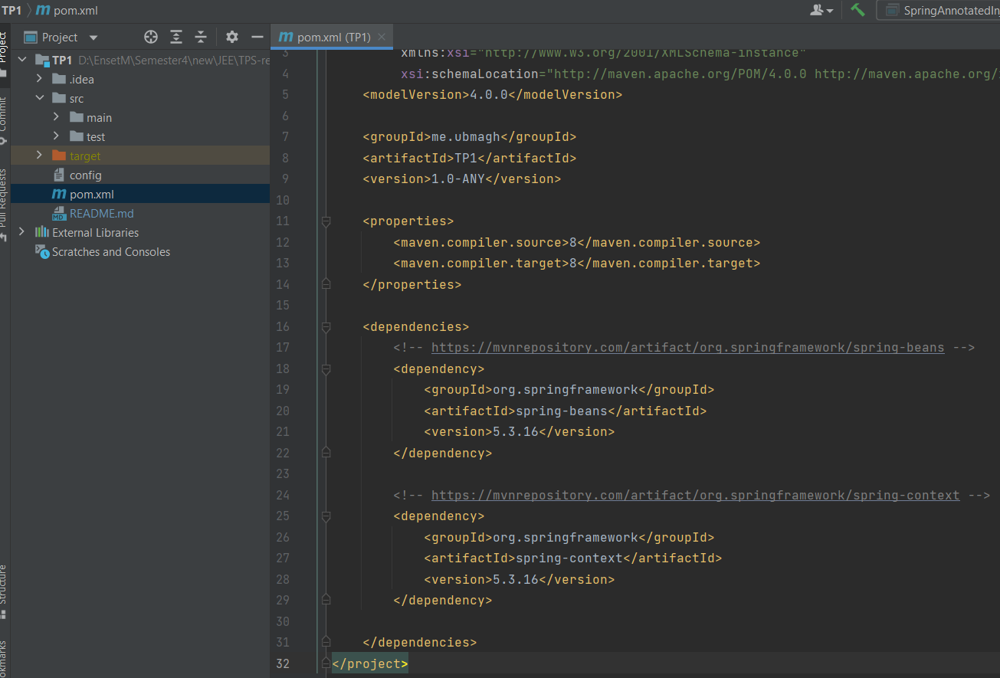
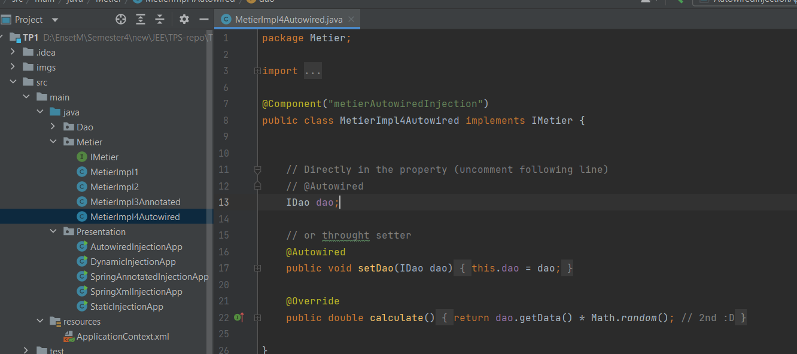

### [ :arrow_backward: liste des tps ](https://github.com/ubmagh/ayoub_maghdaoui-JEE "Go back")
 
  
# TP1: injection des dépendances

- différentes méthodes pour faire l'injection des dépendances.
  - static avec le mot clé `new`
  - par une instanciation dynamique en utilisant un fichier de configuration, ici le fichier texte `config`
  - en utilisant le framework spring :
    - les annotations + autowiring
    - le fichier des dépendences `ApplicationContext.xml` 
- implémentation du principe de l'ouverture à la modification et l'ouverture à l'extension.

### Ennoncé 

 

# Comtpe Rendu 

 

### 1- Créer l'interface IDAO

 

### 2- Implémenter l'interface IDAO

 

### 3- Créer l'interface IMetier 

 

### 4- Implémenter l'interface IMetier 

 

### 5- Faire l'injection des dépendances

#### a- Par instanciation statique :

- Utilisation du mot clé ‘new’
  

 

#### b- Par instanciation dynamique :

- Je fourni un fichier texte pour les classes à utiliser
  

- Voici le contenu du fichier texte (les deux premières lignes qui sont utilisé uniquement) :
  

 

#### c- Injection en utilisant le framework Spring :

- J’ai installé les dépendances nécessaires de Maven : spring-context & spring-beans

  
##### Version XML :

- Dans la classe main, j’ai importé le fichier ApplicationContexte.xml qui contient les classes à utiliser et j’ai lancé la fonction metier.calculate()
  

- Voici le contenu du fichier ApplicationContext.xml, dans lequel il y a deux configuration (dont une est mise en commentaire). Une pour faire l’injection directement dans l’attribut de la classe et une pour injecter en utilisant le constructeur avec paramètre.
  

- Et j’ai fait une deuxième implémentation de l’interface Metier avec constructeur en paramètre, pour pouvoir faire la deuxième injection.
  

 

##### Version Annotation :

- J’ai créé une autre implémentation de l’interface Dao, et je l’ai décoré avec l’annotation Component un nom  ‘dao’
  

- J’ai créé une autre implémentation de l’interface Metier, je l’ai décoré avec l’annotation component et j’ai fourni aussi un nom pour faciliter l’accès.

- Ensuite j’ai créé la classe du programme main, et j’ai affiché le résultat de la fonction metier.calculate() ;
  

 

##### Version AutoWiring :

- Pour faire l’autowiring, j’ai créé une autre implémentation de l’interface Metier, qui va avoir l’attribut ‘dao’ décoré par @Autowired
  

- Ensuite je fait appel à cette implémentation dans une classe qui a une fonction main, pour afficher le résultat .
  

  

