### [ :arrow_backward: TP2 ](https://github.com/ubmagh/ayoub_maghdaoui-JEE/tree/main/TP2 "Go back")
 
  
# TP2: Hospital App

### Compte rendu

Après l'initialisation du projet sur l'editeur intellij avec l'outil 'Spring initializr', avec les dépendances nécessaires :

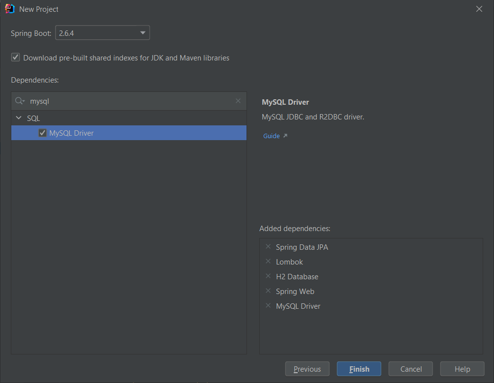
Notez qu'il faut traviller soit avec MySQL soit avec la BD en mémoire H2, j'ai désactivé une (voir `pom.xml`).

 

### Création des entités : 

* J'ai créé le package `entities` qui va regrouper toutes les entités de l'app

 

> l'entité `Patient` :

> l'entité `Medecin` :

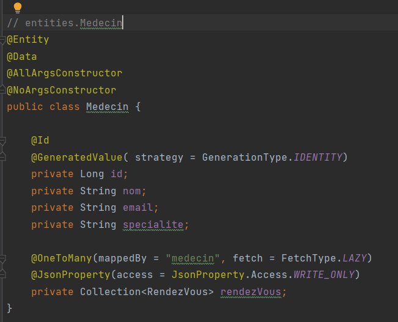

> l'entité `RendezVous` :

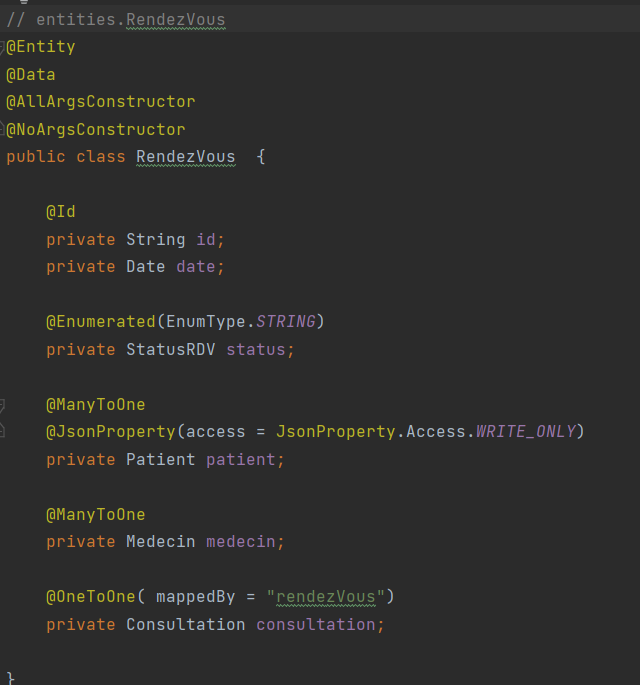

* avec l'enumération `StatusRDV` :
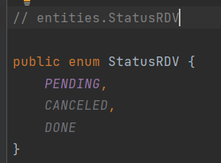

> l'entité `Consultation` :

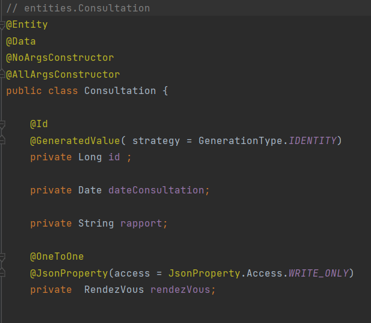

 

### Création des repositories :

* Après la definition des entités, j'ai créé une répository pour chaque entité dans le package `repositories` :

 

> Le repository `PatientRepository` :

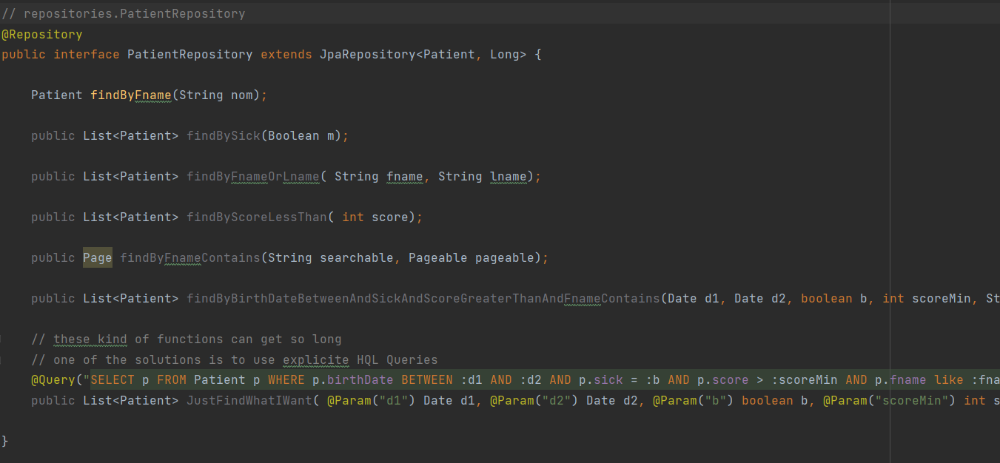

> Le repository `MedecinRepository` :

> Le repository `ConsultationRepository` : (vide)

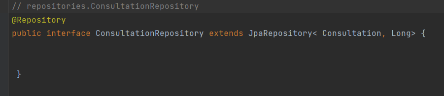

> Le repository `RendezVousRepository` : (vide)

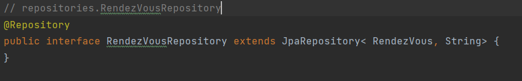

 

### Création d'un service qui va représenter la couche métier :

* avant de coder le service, il faut définir l'interface qui va etre implémentée par le service (couplage faible ;).
* les services existent dans le package `services`

> L'interface implémentée par la couche métier `IHospitalService` : 

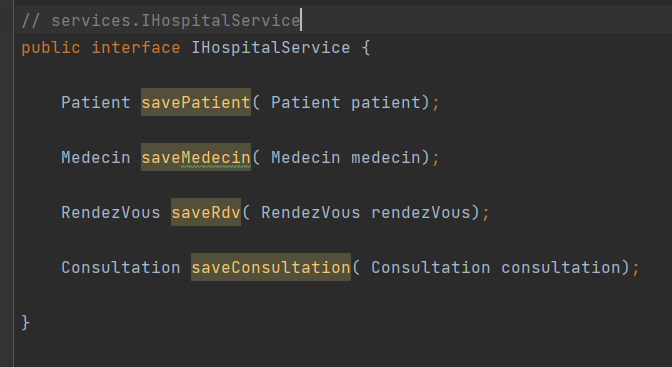

> Le service `IHospitalServiceImpl` :

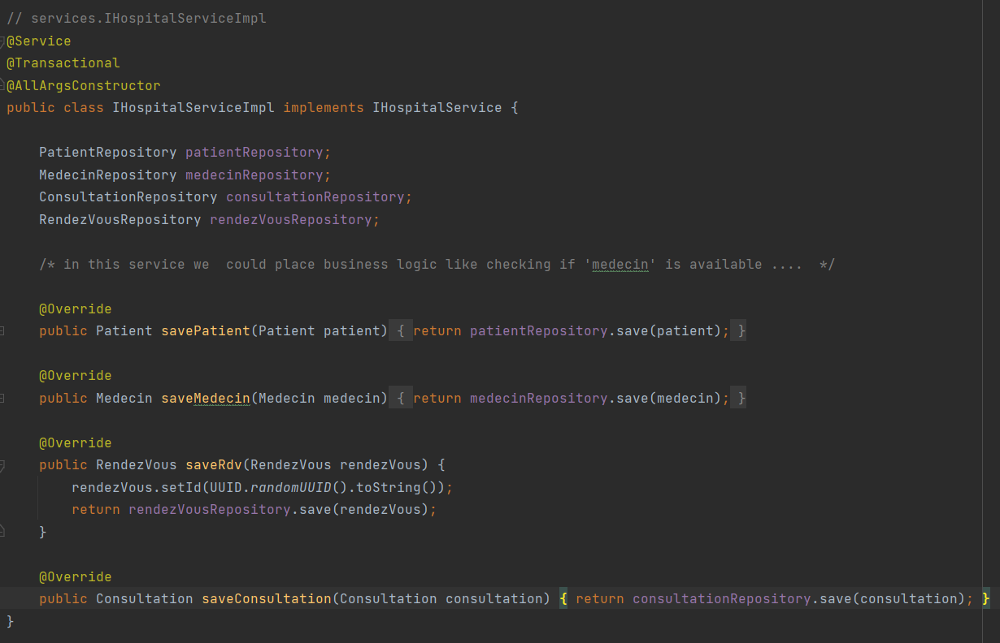

 

### Application Spring :

* Dans une application Spring `SpringDataAppApplication` j'ai essayé de tester les fonctions définies dans le service :
* [voici un lien directe vers ce fichier](https://github.com/ubmagh/ayoub_maghdaoui-JEE/blob/main/TP2/HospitalApp%20-Associations/src/main/java/me/ubmagh/hospital/SpringDataAppApplication.java "here")

> Avant de passer à l'exécution du programme il fallait configurer les paramètres de connexion à la BD `ressources.application.properties` ;

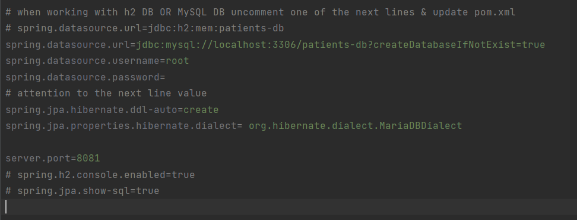

> Voici une partie de l'application Spring qui va faire des insertion dans la BD:

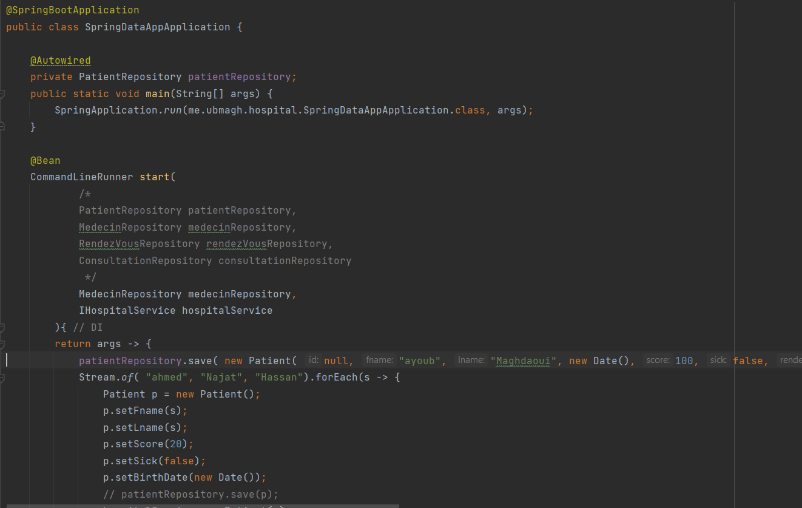

 

* Voici les enregistrements insérés dans la BD, visualisés avec Navicat :

    - La table des patients :
      
      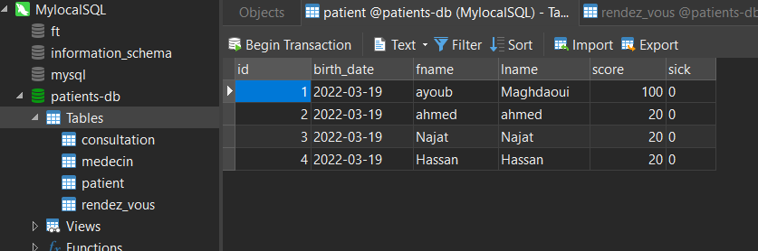

    - La table des medecins :
      
      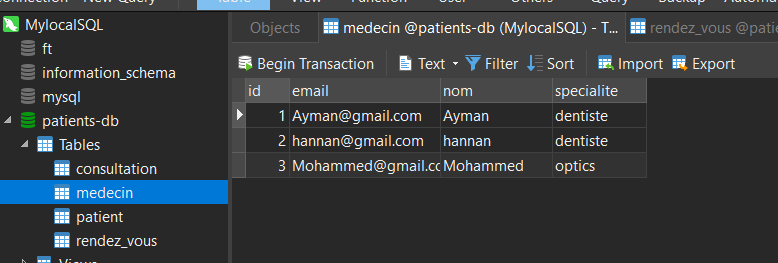

    - La table des rendezVous :
      
      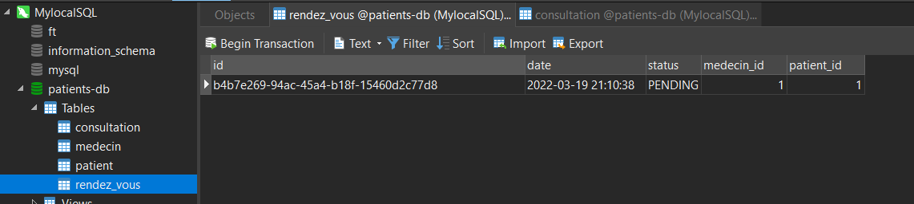

    - La table des consultations :
      
      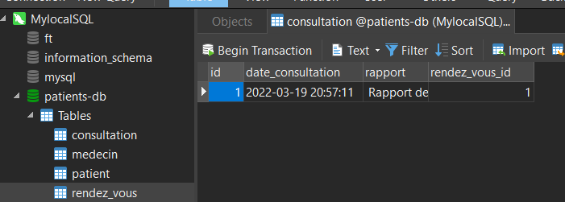

 

### Création d'un controlleur web :

* dans le package `web` j'ai créé le controlleur `PatientsController` qui va contenir une route pour retourner tous les patients sous fromat JSON :

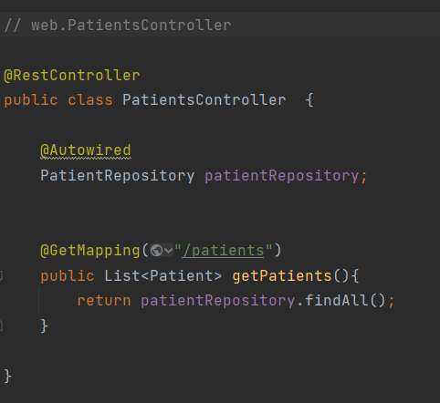

> Au lancement de l'app, le lien `localhsot:8081/patients` retourne les résultats suivants :

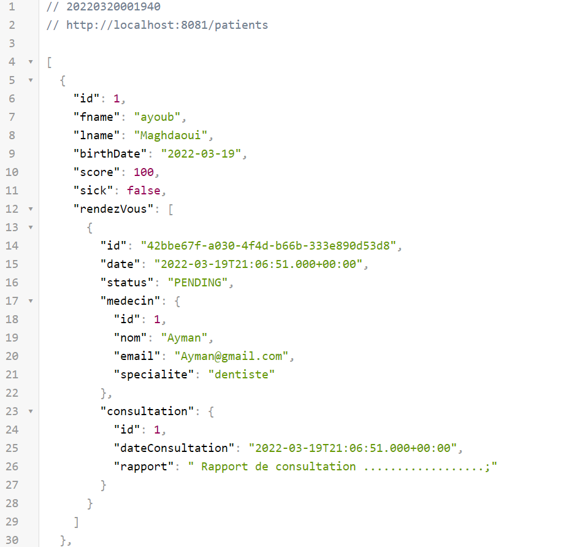

 

> Fin

