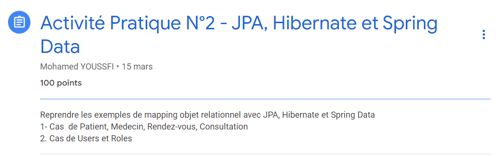

### [ :arrow_backward: liste des tps ](https://github.com/ubmagh/ayoub_maghdaoui-JEE "Go back")
 
  
# TP2: JPA, Hibernate et Spring Data

### Ennoncé 

 

### [:hospital:](https://github.com/ubmagh/ayoub_maghdaoui-JEE/tree/main/TP2/HospitalApp%20-Associations "HospitalApp")

-> Dans cette application nous avons découvert les associations entre les entités. ( OneToOne, OneToMany)
-> nous avons découvert un ensemble des annotions

 

### [:closed_lock_with_key:](https://github.com/ubmagh/ayoub_maghdaoui-JEE/tree/main/TP2/Users%20and%20Roles%20-ManyToMany "HospitalApp")

-> cette deuxième application est un example pour l'association ManyToMany entre les entités user & role.

