### [ :arrow_backward: liste des tps ](https://github.com/ubmagh/ayoub_maghdaoui-JEE "Go back")
 
  
# TP3: Spring Web & thymeleaf

 

### Ennoncé 

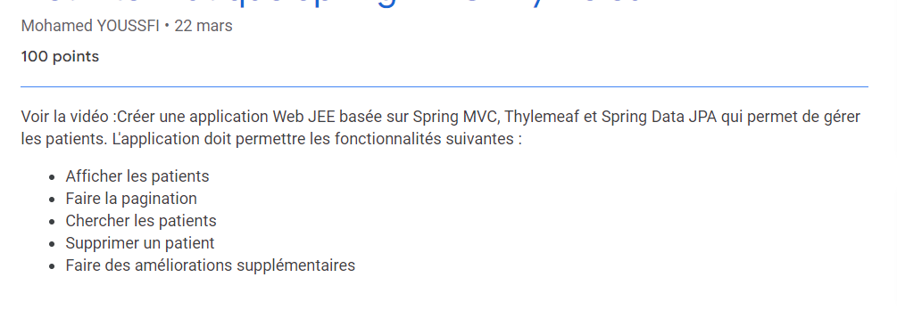

 

##> initialisation du projet sur Intellij

* Initialiser un projet spring Boot avec les dépendaces nécessaires.

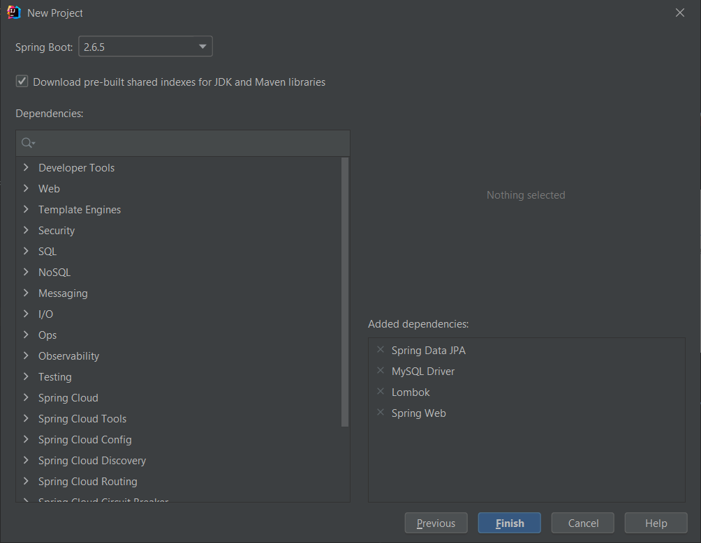

 

## Créer les entités 

* L'entité `Patient` est créée dans le package `entities` :
  
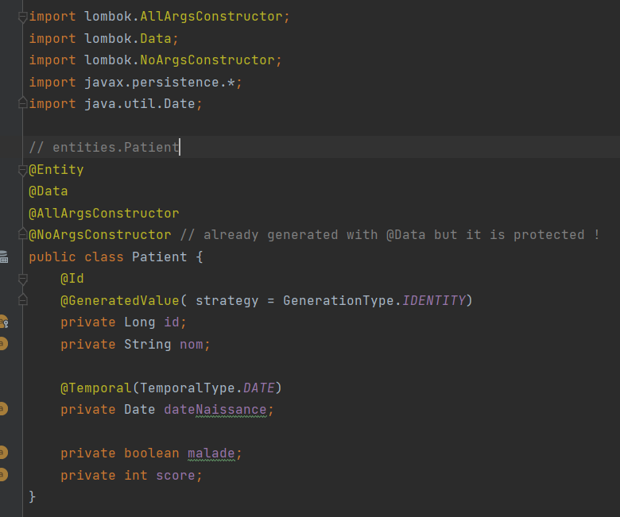

 

## Créer les repositories

* le repository `PatientRepository`, contient une fonction pour faire la recherche des patients par un mot clé :

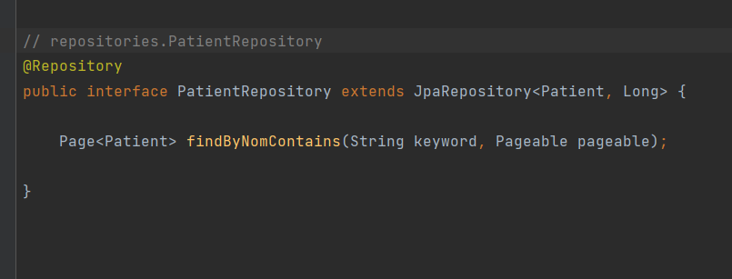

 

## Créer les controlleurs: 

* Le controlleur `PatientController` contient deux méthodes ; une pour retourner la liste des patient créée par Thymeleaf et une autre méthode pour supprimer un patient et une redirection vers la page index:

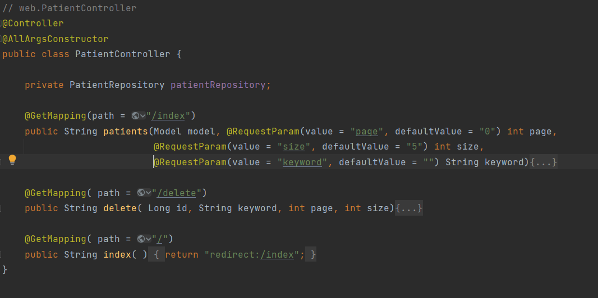

 

## Créer les views/templates

* Dans le chemin `ressources/templates`, j'ai créé le template `patients.html`, ce template est traité par le moteur de rendu thymeleaf, reçoit les données nécessaires à travers le controlleur. 
* Dans ce template j'ai inclu les framework bootstrap et jquery qui sont stocké dans les ressources statiques.

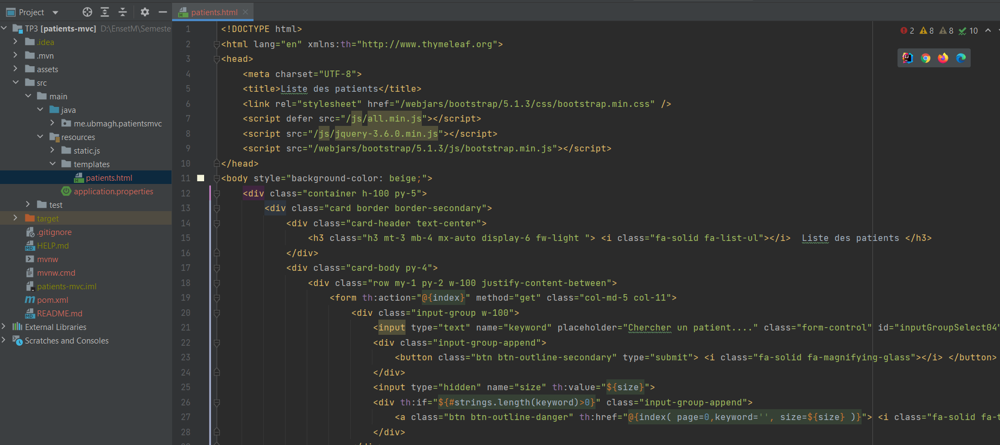

 

* le framework bootstrap utilisé dans ce template est inclu à travers le package :

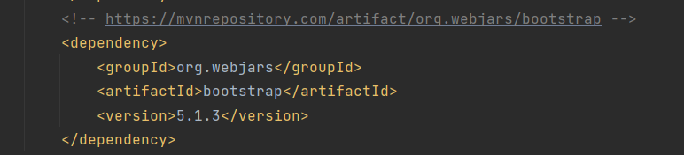

 

## La configuration du projet

* dans le fichier `application.properties` j'ai défini la connexion à la BD :

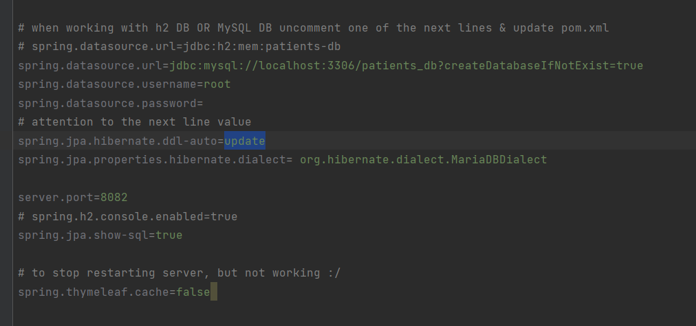

 

## L'application springboot principal

* dans l'application principale j'ai inséré à la base de données quelques enregistrements.

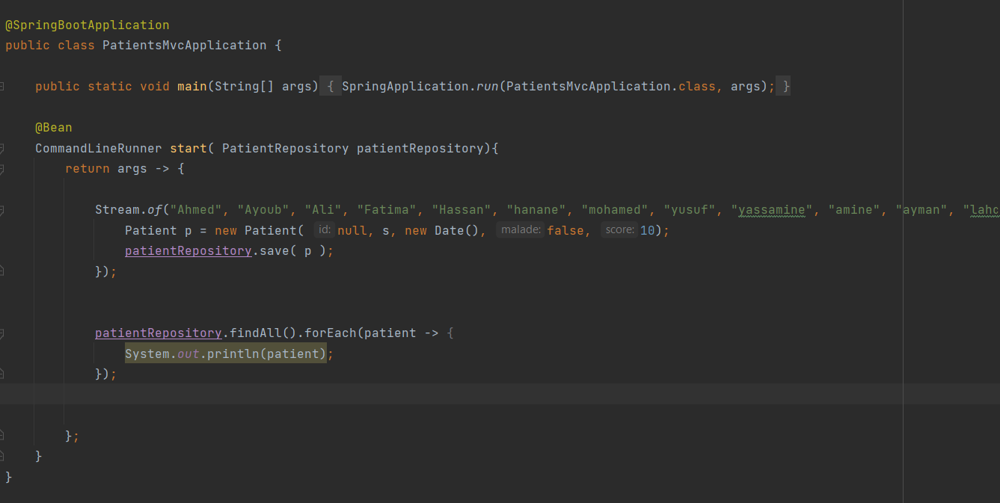

 

## Lancement de l'app : 

* Après avoir lancé l'app, voici la liste des patients avec la pagination :

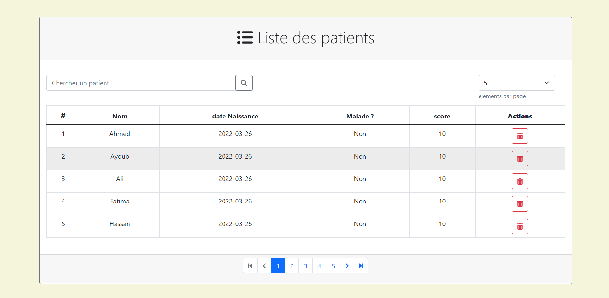

 

## Améliorations ajoutées :

* Confirmer la supprission.
* Changer le nombre des enregistrements par page.
* Ajouter les icons de fontawesome
* utiliser un compteur au lieu de l'ID de l'enregistrement dans la première colonne.
* Améliorer la pagination:
  * si il y a plusieurs page afficher juste 5
    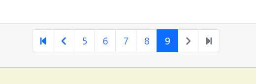
  * Ajouter des boutons pour paginer rapidement 
  * sauvegarder le nombre d'enregistrement lors du pagination

 

> Fin